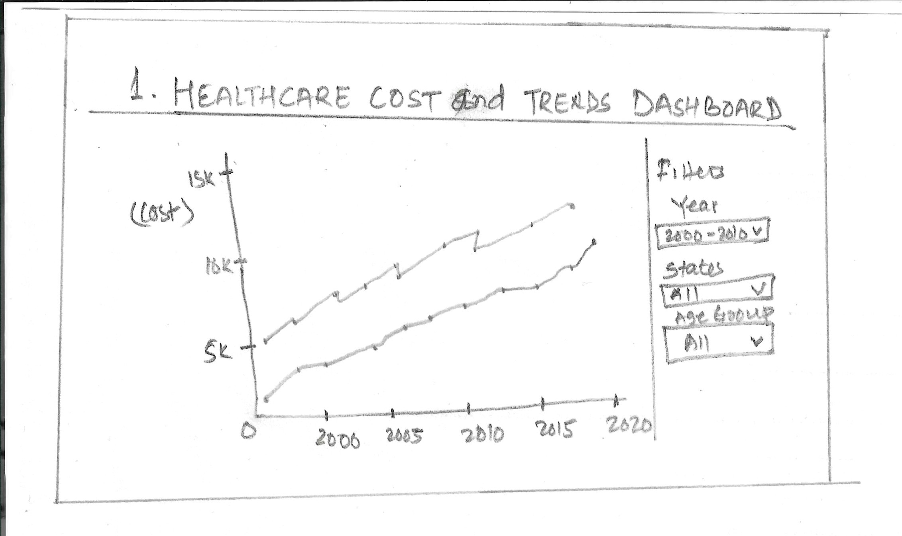
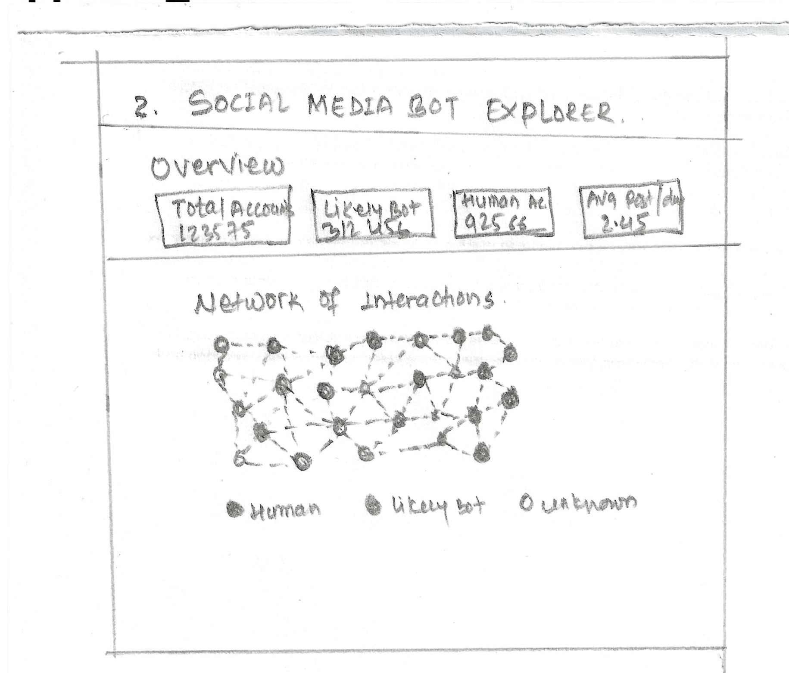
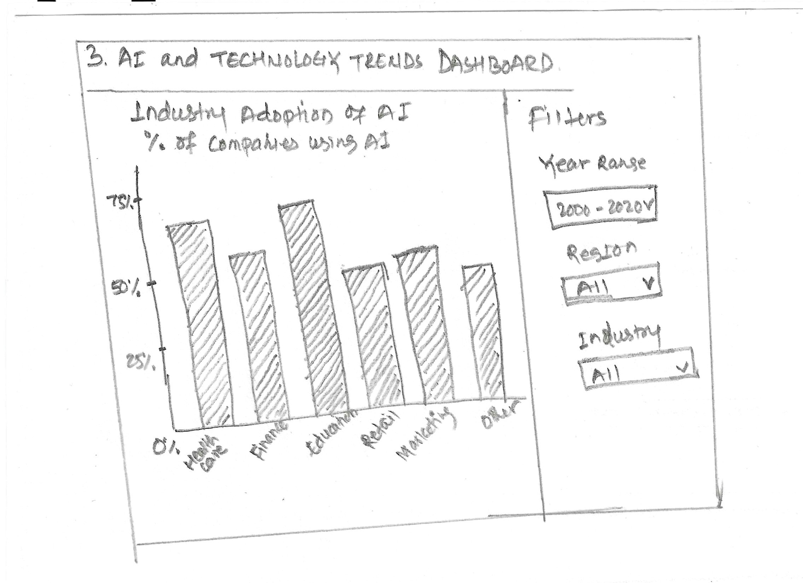
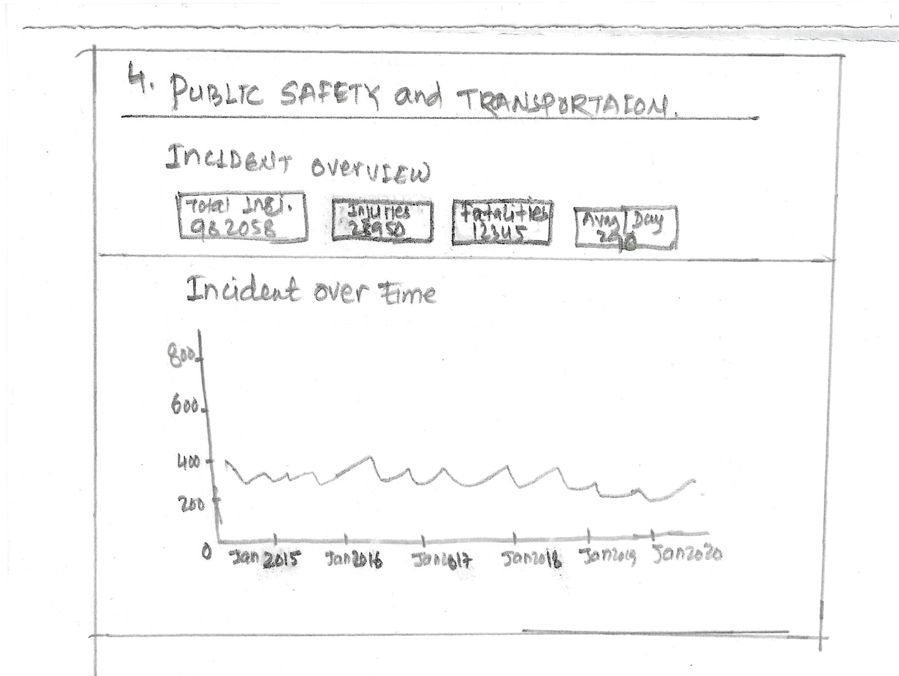

# Final Project Exploration 1

## Introduction
For my final project, I am interested in exploring how interactive data visualization can help people understand complex datasets and identify meaningful patterns. At this stage, I am not selecting a final topic. Instead, I am exploring several possible domains and visualization approaches.

My goal is to eventually create an interactive data visualization application that allows users to explore data rather than simply view static charts. The project could take the form of an interactive dashboard, a scrollytelling visualization, a visualization-centered application, or a combination of these approaches.

The following ideas represent possible directions that I may refine throughout the course.

---

# Idea 1: Healthcare Costs and Trends Explorer

## Topic or Domain
I am interested in exploring healthcare costs and trends in the United States. Healthcare data contains many interconnected factors, including insurance costs, medical spending, prescription drug prices, hospital costs, and health outcomes.

An interactive visualization could help users explore how healthcare costs have changed over time and compare different regions or categories.

## Questions to Investigate
Some questions I might investigate include:
How have healthcare costs changed over time in the United States?
Which healthcare services contribute the most to overall spending?
How do healthcare costs vary across states or regions?
How do healthcare costs compare with health outcomes?
What demographic or economic factors are associated with higher healthcare spending?

## Potential Datasets
Possible data sources include:
- [Peterson-KFF Health System Tracker](https://www.healthsystemtracker.org/)
- [KFF Data and Analysis](https://www.kff.org/)
- [Centers for Medicare & Medicaid Services Data](https://data.cms.gov/)
- [CDC Data Portal](https://data.cdc.gov/)
- [Data.gov Healthcare Datasets](https://www.data.gov/)

I would like to find datasets containing historical healthcare spending, insurance coverage, geographic information, and demographic variables.

## Related Work and Inspiration
Some existing projects and visualizations that could provide inspiration include:
- [Peterson-KFF Health System Tracker](https://www.healthsystemtracker.org/)
- [Our World in Data: Health](https://ourworldindata.org/health-meta)
- [The New York Times Interactive Graphics](https://www.nytimes.com/spotlight/interactive-stories)

## Possible Visualization Ideas: Interactive Healthcare Dashboard

The dashboard could include:
- A line chart showing healthcare costs over time.
- A map showing differences in healthcare costs by state.
- Bar charts comparing healthcare categories.
- Filters for year, location, and demographic groups.

Users could interact with the visualization by selecting different states, time periods, or categories.

### Sketch: Healthcare Dashboard
**Image-1:**

This sketch represents an interactive dashboard layout. I am imagining a large chart at the top showing healthcare costs over time. Additional charts and filters would allow users to explore the data in greater detail.

---

# Idea 2: Social Media Bot and Online Activity Visualization

## Topic or Domain
I am also interested in exploring social media activity and the differences between automated accounts and human accounts. Social media platforms generate large amounts of data that could potentially be explored using interactive visualizations.

A visualization application could help users understand patterns in account activity, posting behavior, networks, and potential bot characteristics.

## Questions to Investigate

Some questions include:

- What characteristics distinguish automated accounts from human accounts?
- How does posting frequency differ between different types of accounts?
- What patterns appear in social networks?
- Are there specific activity patterns associated with bot accounts?
- How can visualizations help identify unusual account behavior?

## Potential Datasets

Possible datasets include:

- [Kaggle Datasets](https://www.kaggle.com/datasets)
- [Bot Repository](https://botometer.osome.iu.edu/bot-repository/datasets.html)
- Social media datasets available through academic research projects.

I would need to investigate dataset availability and determine whether the data can be used appropriately for the project.

## Related Work and Inspiration

Potential inspiration includes:

- [Botometer](https://botometer.osome.iu.edu/)
- Network visualization projects using interactive graphs.
- Research visualizations involving social media activity and misinformation.

## Possible Visualization Idea: Bot Activity Dashboard

The dashboard could include:

- A scatter plot showing relationships between account activity variables.
- Histograms showing posting frequency.
- Bar charts comparing account characteristics.
- Interactive filtering based on account type.

### Sketch : Social Media Network Visualization

**Image-2:**

This sketch represents a network graph in which each node represents an account and connections represent interactions. Different visual properties could represent account activity or classification.

I am interested in exploring how interaction techniques could help users navigate a potentially large and complex network.

---

# Idea 3: Artificial Intelligence and Technology Trends

## Topic or Domain

Another possible topic is the growth and development of artificial intelligence technologies. AI has become increasingly important in many industries, and there may be interesting datasets involving research publications, technology adoption, job trends, or AI-related investments.

## Questions to Investigate

Possible questions include:

- How has AI research changed over time?
- Which countries or organizations produce the most AI research?
- Which areas of AI are growing most rapidly?
- How is AI adoption changing across industries?
- What trends can be identified in AI-related jobs and skills?

## Potential Datasets

Possible sources include:

- [Stanford AI Index](https://hai.stanford.edu/ai-index)
- [Kaggle Datasets](https://www.kaggle.com/datasets)
- [World Bank Open Data](https://data.worldbank.org/)
- Research publication datasets.

## Related Work and Inspiration

Potential sources of inspiration include:

- [Stanford AI Index Report](https://aiindex.stanford.edu/report/)
- Interactive technology trend visualizations.
- Data-driven reports from research organizations.

## Possible Visualization Ideas: AI Trends Dashboard

An interactive dashboard could allow users to explore AI trends by:

- Year.
- Country.
- Research area.
- Industry.
- Technology category.

A timeline could show the growth of different AI technologies and important milestones.

### Sketch: AI Trends and Technology Dashboard

**Image-3:**

This sketch represents a dashboard containing a timeline, geographic visualization, and several comparison charts.

Users could interact with filters to investigate how AI development differs across countries, industries, and time periods.

# Idea 4: Public Safety and Transportation Data

## Topic or Domain

A final possible direction is exploring transportation and public safety data. This could include traffic accidents, transportation patterns, road safety, or other geographic datasets.

This topic could work well for an interactive visualization because location and time are both important components of the data.

## Questions to Investigate

Possible questions include:

- Where do transportation incidents occur most frequently?
- Are there specific times when incidents are more common?
- How do transportation patterns vary across different locations?
- What relationships exist between population, traffic volume, and incidents?
- Can users identify geographic patterns through interactive exploration?

## Potential Datasets

Potential sources include:

- [Data.gov Transportation Data](https://www.data.gov/)
- [National Highway Traffic Safety Administration](https://www.nhtsa.gov/)
- Local and state open data portals.

## Related Work and Inspiration

Possible inspiration includes:

- Interactive transportation maps.
- Public safety dashboards.
- Geographic data visualizations using interactive maps.

## Possible Visualization Ideas

The application could display incidents on an interactive map.

Users could filter the data by:

- Date.
- Time.
- Location.
- Incident type.

Selecting a location could reveal additional information and related visualizations.

### Sketch: Incident Map

**Image-4:**

---

# Initial Comparison of Project Ideas

| Project Idea | Main Visualization Approach | Potential Interaction |
|---|---|---|
| Healthcare Costs | Dashboard and map | Filtering, comparisons, state selection |
| Climate Trends | Timeline and global explorer | Country selection and time slider |
| Social Media Bots | Network and dashboard | Network exploration and filtering |
| AI Trends | Dashboard and timeline | Filtering by country, industry, and year |
| Transportation | Map and timeline | Geographic and temporal filtering |

At this stage, the healthcare, climate, and social media bot ideas are particularly interesting because they contain complex datasets with multiple dimensions that could benefit from interactive exploration.

However, I will continue exploring all of these possibilities before selecting a final project topic.

---

# Current Direction and Next Steps

The purpose of this exploration is to consider multiple possibilities rather than immediately commit to one visualization. Over the next several weeks, I plan to:

1. Explore the potential datasets in more detail.
2. Determine which datasets are sufficiently complete and accessible.
3. Investigate additional examples of interactive visualizations.
4. Create several quick hand-drawn sketches.
5. Consider the technical requirements for each project.
6. Narrow the list to one or two promising directions.
7. Begin developing a more detailed project concept.

The final project will ideally become a professional-level interactive data visualization application that demonstrates both effective visualization design and meaningful user interaction.

At this stage, I am most interested in creating an application that allows users to actively explore relationships and patterns in the data instead of simply presenting a collection of static charts.
