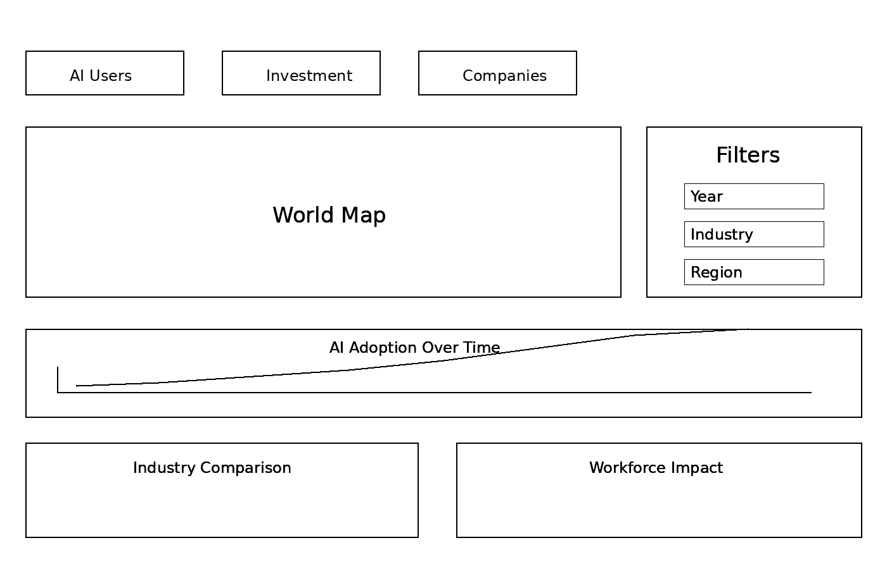
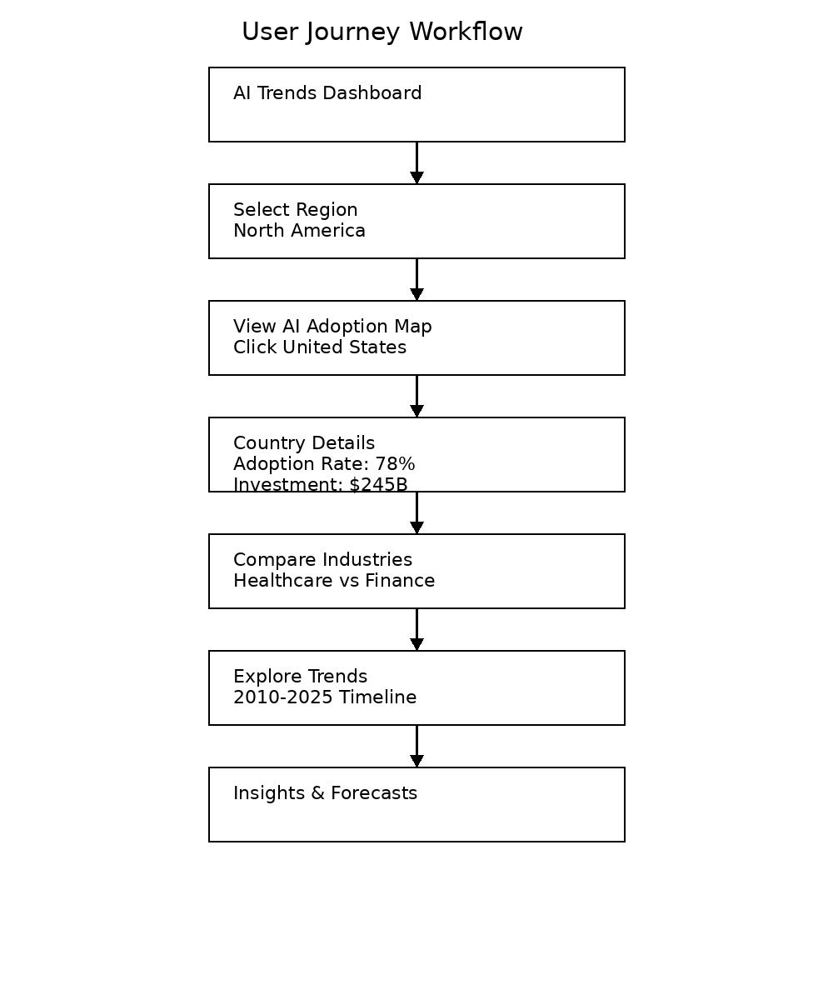

# AI & Technology Trends Explorer: An Interactive Visualization System for Exploring Artificial Intelligence Adoption and Impact

## Introduction

Artificial intelligence (AI) has become an important technology across research, business, education, healthcare, finance, manufacturing, and many other domains. However, information about AI development is often distributed across separate reports and datasets, making it difficult to understand how adoption, investment, research activity, and workforce effects relate to one another.

The proposed project, *AI & Technology Trends Explorer*, will be an interactive visualization system that allows users to explore AI adoption and impact across time, industries, countries, and technology areas. The project has evolved from a broad dashboard idea into a more task-centered visualization application in which users can begin with an overview, filter the data, compare groups, investigate relationships, and progressively move toward more detailed insights.

---

# Project Motivation

The project is motivated by the challenge of making multidimensional AI trend data easier to explore and compare. Instead of presenting a collection of unrelated static charts, the goal is to create coordinated visualizations that help users investigate meaningful analytical questions.

The project seeks to answer questions such as:

- How has AI adoption changed over time?
- Which industries are adopting AI most rapidly?
- Which countries or regions show the strongest growth in AI activity?
- Which areas of AI research are growing most rapidly?
- How does AI investment vary across countries, industries, or technology areas?
- What relationships exist between AI adoption, investment, research activity, and workforce change?
- Which countries, industries, or AI areas differ substantially from broader trends?
- What emerging patterns may indicate changes in the direction of AI development?

---

# Evolution of the Project

The original project exploration considered several possible domains, including healthcare costs, social media bots, AI and technology trends, and public safety/transportation. After comparing these ideas, AI and technology trends became the strongest direction because the topic naturally supports temporal, geographic, categorical, and quantitative analysis within one interactive system.

The earlier exploration described a dashboard with a timeline, geographic visualization, comparison charts, and filters for year, country, research area, industry, and technology category. The revised proposal keeps those ideas but organizes them around user tasks rather than around chart types.

Course assignments also changed how I think about the project. Important new ideas include:

- Designing around **user goals and analytical tasks**, not simply selecting charts.
- Choosing visual encodings according to the structure of the data and the comparison a user needs to make.
- Connecting views through **interactive filtering, selection, brushing, and highlighting**.
- Supporting both overview and detail so a user can first see a broad pattern and then investigate a specific country, industry, year, or AI category.
- Using a dashboard as an analytical system rather than as a collection of independent graphics.
- Considering validation throughout the design process instead of waiting until the implementation is finished.
- Distinguishing between the domain problem, the data/task abstraction, the visual encoding and interaction design, and the technical implementation.

The result is a more focused project concept: a coordinated interactive explorer in which selections made in one visualization update the other views and help the user construct an evidence-based understanding of AI trends.

---

# Project Objectives

1. Visualize long-term changes in AI adoption, research, investment, and workforce indicators.
2. Compare AI activity across countries, industries, organizations, and technology areas when supported by the available data.
3. Examine geographic variation in AI growth and adoption.
4. Investigate relationships among adoption, investment, research activity, and workforce change.
5. Identify fast-growing categories, major shifts, and unusual observations.
6. Support exploratory analysis through filtering, linked views, details-on-demand, and comparison interactions.
7. Present source and context information so users can understand what each metric represents.
8. Build a responsive application that can support both broad overview and focused investigation.

---

# Target Audience and Ideal User

The dashboard could support several audiences:

- Students and educators studying technology trends.
- Technology researchers examining AI development.
- Industry analysts comparing adoption across sectors.
- Business professionals interested in emerging technology.
- Policymakers examining geographic or workforce patterns.
- Members of the public who want an accessible overview of AI development.

For design purposes, an ideal primary user is a **technology analyst or graduate student** who wants to compare AI activity across countries and industries and understand how those patterns have changed over time.

A typical user might begin with a question such as, *"Which industries have experienced the strongest increase in AI adoption during the last several years, and does that increase correspond with investment or workforce changes?"* The dashboard should allow the user to move from this broad question to progressively more focused comparisons.

---

# Data Sources

Potential sources identified during the project exploration include:

- [Stanford AI Index](https://hai.stanford.edu/ai-index)
- [Stanford AI Index Report](https://aiindex.stanford.edu/report/)
- [Kaggle Datasets](https://www.kaggle.com/datasets)
- [World Bank Open Data](https://data.worldbank.org/)
- OECD technology and digital-economy indicators.
- Research publication datasets.
- Technology investment datasets.
- Industry AI-adoption surveys.
- Workforce and employment datasets.

The final set of sources will depend on whether variables can be aligned across compatible years, countries, industries, and definitions. A smaller coherent dataset is preferable to combining many incompatible measures.

---

# Data and Task Abstraction

The project will likely include several data types:

- **Temporal data:** year or reporting period.
- **Geographic data:** country, region, or other location.
- **Categorical data:** industry, AI domain, organization type, or technology area.
- **Quantitative data:** adoption percentage, publication count, investment amount, job postings, employment indicators, or growth rate.

The system should support the following analytical tasks:

- Identify trends and temporal changes.
- Compare countries, industries, AI domains, or time periods.
- Rank categories by a selected metric.
- Detect emerging or rapidly changing AI areas.
- Identify outliers and unusual observations.
- Explore relationships among multiple quantitative variables.
- Filter to relevant subsets of the data.
- Select a country, industry, or category and inspect details.
- Maintain context while moving from an overview to a more specific view.
- Form and evaluate hypotheses based on observed patterns.

These tasks will guide the final choice of visual encodings and interactions.

---

# Proposed Visualization Components

## 1. Overview and KPI Summary

A compact overview will display selected high-level indicators such as AI adoption, investment, research activity, or AI-related workforce measures. The goal is to provide orientation rather than to replace the detailed visualizations.

## 2. Temporal Trend Analysis

A line chart or small set of coordinated time-series views will show changes in selected AI indicators over time. Users should be able to select one or more countries, industries, or AI areas for comparison.

## 3. Industry Adoption Comparison

Ranked bar charts will compare industries using a selected measure. Sorting and filtering can help users identify leading, emerging, or rapidly changing industries.

## 4. Geographic Distribution Visualization

An interactive map will display geographic differences in adoption, investment, research activity, or another selected metric. Selecting a country or region will update the linked charts.

## 5. Investment and Innovation Analysis

Scatterplots or bubble charts can be used to examine relationships between variables such as investment and adoption, investment and research activity, or adoption and workforce demand.

## 6. Workforce Impact Visualization

Charts will examine AI-related employment or skills indicators when appropriate data is available. This view can help users compare workforce changes with adoption or investment trends.

## 7. Context and Insight Panel

A side panel will summarize the current selection, explain metrics, show data-source information, and surface notable values or differences without automatically claiming causation.

---

# Interaction Design

The final application should support coordinated interaction across views. Possible interactions include:

- Filtering by year, country, industry, AI area, and metric.
- Selecting a geographic region to update other charts.
- Hovering for details-on-demand.
- Brushing a time range to focus the dashboard.
- Highlighting the same category across multiple views.
- Comparing two selected countries, industries, or AI categories.
- Resetting the dashboard to the global overview.
- Showing annotations or major contextual events on the timeline where appropriate.
- Preserving source and metric definitions so users can interpret comparisons correctly.

A central design goal is **linked exploration**: a user should not have to interpret each chart independently. Instead, selections should carry across the dashboard.

---

# Integration of Previous assignments

Several earlier assignments can contribute directly to the final project. The visualization critique, task analysis, and validation work helped shape how the final dashboard will be organized and evaluated.

The visualization critique work will inform the final design by showing how chart choice, visual encoding, labels, scale, and emphasis affect interpretation. The same principles will be applied when choosing encodings for AI trends:

- Use position and length for precise quantitative comparison where possible.
- Avoid unnecessary visual complexity.
- Use color intentionally to represent categories, magnitude, or selection state.
- Provide labels and context that make each metric interpretable.

The task analysis work identified user goals such as understanding growth in AI research, investment, and adoption, and comparing activity across countries, industries, or organizations. The final dashboard will be organized around tasks such as:

- identify growth trends;
- compare groups;
- detect significant shifts;
- identify emerging AI areas;
- investigate geographic differences; and
- inspect cases that differ from broader patterns.

This prevents the project from becoming a dashboard that contains charts without a clear analytical purpose.

The Four Levels of Validation assignment provides a framework for evaluating the project from the problem definition through the technical implementation. The project will validate:

1. whether the domain questions are meaningful;
2. whether the data and task abstractions represent those questions correctly;
3. whether the visual encodings and interactions support the intended tasks; and
4. whether the implementation is correct, responsive, and reliable.

---

# Validation

The project will apply the Four Levels of Validation described in the course material.

## Level 1: Domain Problem and Data Characterization

The first question is whether the project addresses a meaningful problem for the intended user. An ideal user could be a technology analyst, researcher, graduate student, policymaker, or business professional interested in AI development.

The project should support meaningful questions about:

- AI research growth;
- geographic differences;
- industry adoption;
- investment;
- workforce change; and
- emerging AI areas.

A hypothetical interview or feedback session could ask users which questions they would actually investigate and what context they would need before drawing conclusions.

## Level 2: Data and Task Abstraction

AI trend data can include time, country, organization, industry, research area, publication count, investment, adoption measures, and workforce indicators.

The key tasks include:

- comparing groups;
- identifying growth trends;
- ranking categories;
- detecting emerging areas;
- finding outliers; and
- exploring differences across regions and time periods.

Validation at this level will check whether the selected variables and operations actually allow users to answer the domain questions.

## Level 3: Visual Encoding and Interaction Design

The project may use:

- line charts for change over time;
- maps for geographic patterns;
- ranked bars for country or industry comparison;
- scatterplots for relationships among quantitative variables; and
- linked filters and selections for moving between overview and detail.

Prototype testing can use concrete tasks such as:

- Identify the fastest-growing AI area during a selected period.
- Compare two industries.
- Compare two countries using the same metric.
- Find an unusual country or industry that does not follow the general pattern.
- Determine whether a selected increase in adoption coincides with a change in another metric.

Success can be evaluated through completion accuracy, time, observed confusion, and user comments.

## Level 4: Algorithm and Implementation

The final level will evaluate technical correctness and performance.

Validation will include:

- checking calculations for rankings, growth rates, and aggregations;
- verifying that filtering produces the expected subset;
- verifying that map entities are matched correctly;
- checking that linked views remain synchronized;
- testing missing-data behavior;
- checking interaction responsiveness; and
- verifying that the application remains usable with the final dataset size.

If the dataset becomes too large, preprocessing or aggregation may be used to preserve interactive performance.

---

# North Star Vision

The north star is an ambitious version of the project that combines overview, geographic exploration, comparison, temporal analysis, relationship analysis, and linked interaction in a single coherent application.

## Figure 1. North Star Dashboard Wireframe

**Figure 1.** North star dashboard wireframe for the AI & Technology Trends Explorer. The layout combines high-level indicators for AI users, investment, and companies with a central world map, filtering controls for year, industry, and region, a time-series view for AI adoption, an industry comparison area, and a workforce impact area. This wireframe represents the ideal dashboard structure for connecting overview, filtering, comparison, and detailed analysis in one coordinated interface.

## Figure 2. User Journey Workflow

**Figure 2.** User journey workflow showing how a user could move through the dashboard. The flow begins at the AI Trends Dashboard, then narrows through region selection, map exploration, country details, industry comparison, trend exploration, and finally insights and forecasts. This workflow connects the visual interface to a realistic sequence of analytical tasks and shows how linked views can guide the user from a broad question toward specific insights.

### North Star User Experience

An ideal workflow would be:

1. The user opens the AI Trends Dashboard and sees a high-level overview.
2. The user selects a region, such as North America.
3. The user views the AI adoption map and selects a country, such as the United States.
4. The dashboard presents country-level details such as adoption rate and investment.
5. The user compares industries, for example healthcare and finance.
6. The user explores the historical trend over a selected time period.
7. The system presents a final synthesis area for insights and possible forecasts.
8. At any point, the user can change the year, industry, or region filters to investigate a different question.

### Ambitious Features

If time and data permit, the ideal version could also include:

- animated transitions through time;
- saved comparison states;
- annotations for major AI milestones;
- downloadable chart images or filtered data;
- a guided scrollytelling introduction that transitions into the exploratory dashboard;
- responsive layout for different screen sizes; and
- accessibility considerations such as keyboard navigation, readable labels, and color-safe encodings.

These features are intentionally ambitious. The core project can still be successful with a smaller subset, but this design defines the direction I would ideally like to reach by the end of the course.

---

# Implementation Direction

A practical implementation can be developed as a web-based visualization application. The exact framework can be selected after the dataset is finalized, but the implementation should support:

- interactive filtering;
- coordinated views;
- tooltips and details-on-demand;
- geographic visualization;
- time-series visualization;
- comparison charts; and
- efficient data transformation.

The implementation should be developed incrementally. A reasonable order would be:

1. Prepare and validate the dataset.
2. Build one temporal view.
3. Add industry or categorical comparison.
4. Add the geographic view.
5. Connect the views through shared filters and selections.
6. Add the relationship view.
7. Add the context/insight panel.
8. Conduct task-based validation and revise the interface.

---

# Expected Contributions

The project will demonstrate how information visualization can be used to explore a contemporary, multidimensional topic. Its main contribution will not be a single chart, but an interactive system that coordinates several views around meaningful user tasks.

The project should demonstrate:

- effective visual encoding;
- support for overview and details-on-demand;
- coordinated interaction;
- geographic and temporal exploration;
- task-centered design;
- iterative validation; and
- evidence-based interpretation of AI trend data.

---

# Scope and Priorities

Because the north-star design may be too ambitious for the available course timeline, the project will prioritize the features that are most important for analytical value.

**Core features:**

- one cleaned, coherent AI trends dataset;
- year, country/region, industry/category, and metric filtering where supported;
- temporal trend visualization;
- at least one comparison view;
- geographic visualization if appropriate geographic data is available;
- coordinated interaction between views; and
- source/context information.

**Stretch features:**

- relationship view using multiple indicators;
- workforce analysis;
- scrollytelling introduction;
- animated transitions;
- export functionality; and
- advanced insight or annotation features.

This prioritization allows the project to preserve the north-star direction while remaining feasible.

---

# Conclusion

The revised *AI & Technology Trends Explorer* has evolved from an early dashboard concept into a task-centered interactive visualization system. The project will focus on helping users compare AI activity, identify trends, investigate geographic and industry differences, and explore relationships among multiple indicators.

The revised concept incorporates lessons from task analysis, visual encoding, interaction design, dashboard organization, and the Four Levels of Validation. The new north-star sketch provides an ambitious target for the final system while the scope section identifies a realistic core that can be implemented first.
